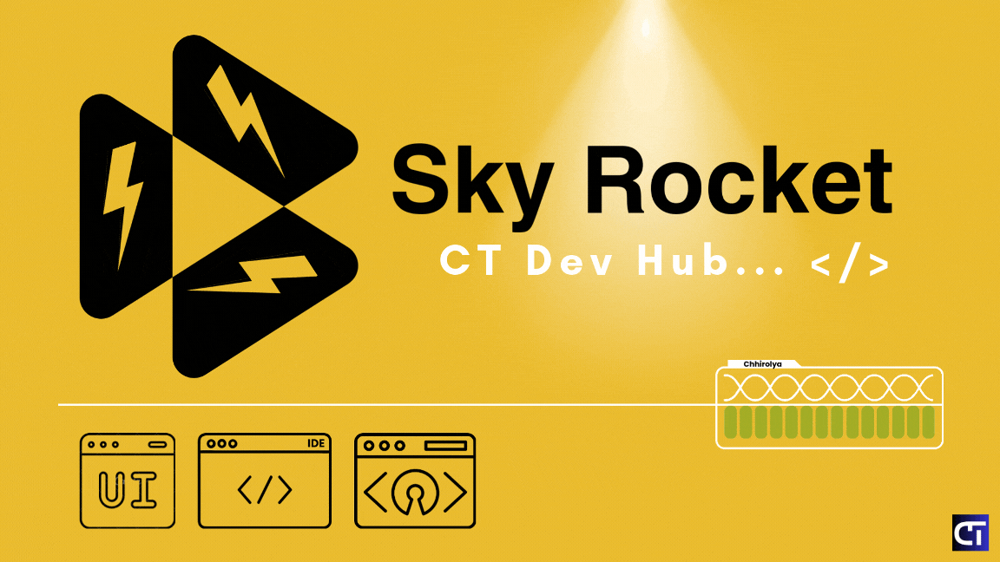

Sky Rocket - CT Dev Hub powwered by Chhirolya Technologies

---

# Sky Rocket Dark Theme for VS Code Editors🚀

Sky-Rocket: A high-performance theme designed to supercharge your coding experience. With seamless visuals and productivity in mind, this theme helps developers code smarter, faster, and with unmatched focus. Let your workspace inspire greatness! 🌌

- Visual Studio Code Editor Theme --> [Install](https://marketplace.visualstudio.com/items?itemName=SkyRocket.sky-rocket)

## 🌟 Installation

1. Open the Extensions view (`Ctrl+Shift+X`).
2. Search for `Sky-Rocket Theme`.
3. Click **Install** to install the theme.
4. Click **Reload** to reload your editor.
5. Navigate to File > Preferences > Color Theme > **Sky-Rocket** to activate the theme.

## ✨ Features

- **Dark background** with vibrant syntax highlighting. 🎨
- **Easy on the eyes** for long coding sessions. 👀
- Supports a **wide range of programming languages**. 💻

## 🤝 Contributing

If you would like to contribute to the development of Sky-Rocket, please follow these steps:

1. Fork the repository. 🍴
2. Create a new branch (`git checkout -b feature-branch`). 🌿
3. Make your changes. ✍️
4. Commit your changes (`git commit -am 'Add new feature'`). 💾
5. Push to the branch (`git push origin feature-branch`). 🚀
6. Create a new Pull Request. 🔄

## 🐞 Issues

If you encounter any issues or have suggestions for improvements, please open an issue on the [GitHub repository](https://github.com/your-repo/sky-rocket-theme/issues). 📝

## 📜 License

This project is licensed under the MIT License. See the [LICENSE](LICENSE) file for details. 📄

**Enjoy coding with Sky-Rocket!** 🎉

